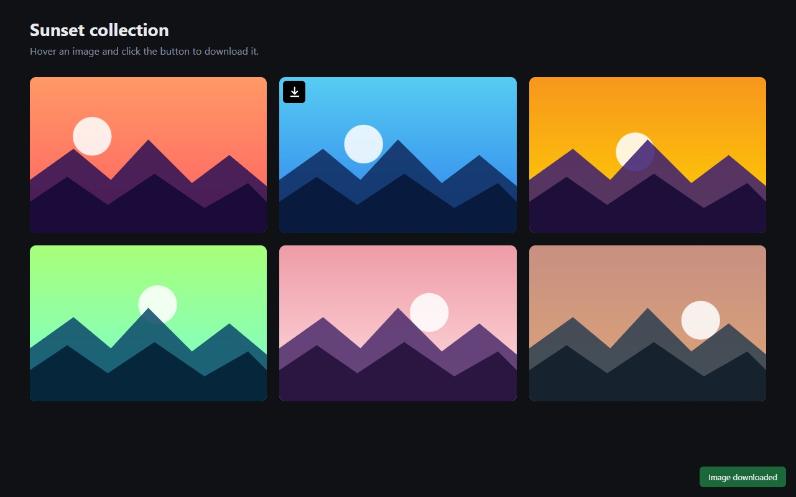

# Imgrab

Download any image on the web with one click — even on sites that block hotlinking.

Imgrab adds a small download button over images, a right-click menu entry, a keyboard shortcut and optional mouse
triggers. It fetches the original file (no re-encoding) and sends the proper `Referer`, so images that normally
answer `403 Forbidden` or serve a JSON error page download correctly.



Works on Chromium-based browsers (Chrome, Edge, Brave, Opera, Vivaldi) using Manifest V3.

## Features

- **Hover button** over images: configurable size, opacity, skin, corner, persistence, and drag-and-drop onto the button.
- **Mouse triggers**: single/double left or right click, optional *Shift* requirement.
- **Context menu**: *Download* on images and *Download images* on a text selection.
- **Hover hotkey**: downloads the image under the cursor (default `Alt+Shift+D`, rebindable in the browser's shortcut page).
- **Anti-hotlink bypass**: the `Referer`/`Origin` headers are set per request; the response is validated so an
  error page is never saved as an image.
- **File naming**: pattern tokens (`%original%`, `%counter%`, `%pagedomain%`, `%y%`, `%title%`, …), counter
  start/step/padding, sub-folder, and conflict handling (unique name, *Save As* dialog, overwrite).
- **Restrictions**: minimum image size and domain allow/block lists for pages and for images.
- **Feedback**: on-page toast and optional desktop notification.
- **Localized**: English and Brazilian Portuguese (`_locales/`); the browser picks the language.

## Install (from source)

1. Clone or download this repository.
2. Open `chrome://extensions` (or `edge://extensions`) and enable **Developer mode**.
3. Click **Load unpacked** and select the repository folder.

Keep the folder in place: the browser loads the extension directly from it.

## Usage

Hover an image and click the button. Everything else (triggers, naming, restrictions) is in the extension's
**Options** page. The default save location is `Downloads/ImageDownloader/`.

### Filename tokens

| Token | Value |
| --- | --- |
| `%original%` | Original file name, without extension (the extension is preserved) |
| `%counter%` | Numeric counter, restarts each browser session |
| `%pagedomain%` | Domain of the page |
| `%pagedirs%` / `%pagepath%` | Folder path of the page (with `/` or `.`) |
| `%imagedomain%` | Domain of the image |
| `%imagedirs%` / `%imagepath%` | Folder path of the image (with `/` or `.`) |
| `%y%` `%M%` `%d%` `%h%` `%m%` `%s%` `%ms%` | Date and time parts |
| `%title%` | Page title (a `/` creates a sub-folder) |

## How it works

| File | Role |
| --- | --- |
| `manifest.json` | Manifest V3 definition |
| `background.js` | Service worker: download pipeline, `Referer` rules, context menu, hotkey |
| `offscreen.js` / `.html` | Offscreen document that fetches the image and exposes it as a `blob:` URL |
| `content.js` | Image detection, hover button, mouse triggers, toasts |
| `shared.js` | Defaults, filename rendering and domain matching (used by every context) |
| `options.html` / `.js` | Settings page |
| `_locales/` | Translations (`en`, `pt_BR`) |
| `scripts/` | `package.ps1` (store zip) and `screenshots.mjs` (screenshots + end-to-end smoke test) |

The `Referer` header is applied with `declarativeNetRequest` session rules scoped to a single image URL and removed as
soon as the request finishes. The fetch is done in an offscreen document because browsers do not apply those rules
to requests started by `chrome.downloads`.

## Permissions

| Permission | Why |
| --- | --- |
| `host_permissions: <all_urls>` | Images can live on any domain; needed to fetch them and to run on any page |
| `downloads` | Save the file |
| `declarativeNetRequest` | Set `Referer`/`Origin` for the image request |
| `offscreen` | Fetch the image and create a `blob:` URL (service workers cannot) |
| `storage` | Save your settings |
| `contextMenus` | Right-click entries |
| `notifications` | Optional "download finished" notification |

See [PRIVACY.md](PRIVACY.md): Imgrab collects no data and makes no network requests other than fetching the image you asked to download.

## Development

No build step. Edit the files, then press the reload icon on the extension's card in `chrome://extensions`, and
refresh open tabs (old tabs keep the previous content script and show a *reload the page* message).

Build a store package:

```powershell
powershell -ExecutionPolicy Bypass -File scripts/package.ps1
```

This produces `dist/imgrab-<version>.zip`, containing only the files the extension needs.

Regenerate the store screenshots (also works as an end-to-end smoke test; needs Edge or Chrome installed):

```sh
node scripts/screenshots.mjs
```

To add a language, copy `_locales/en/messages.json` to `_locales/<code>/messages.json` and translate the `message` fields.

## Contributing

Issues and pull requests are welcome. Keep changes small and focused, and avoid adding permissions unless they are
strictly required.

## License

[MIT](LICENSE) © Matheus Souza de Oliveira (Patitow Dev)
